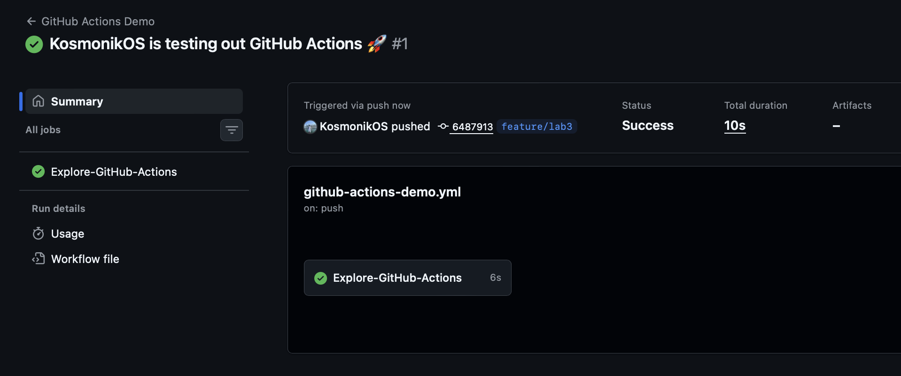
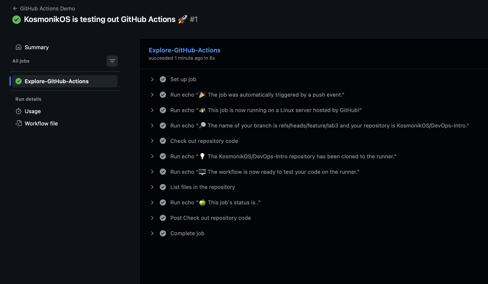
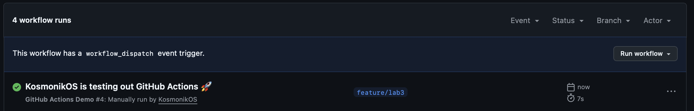
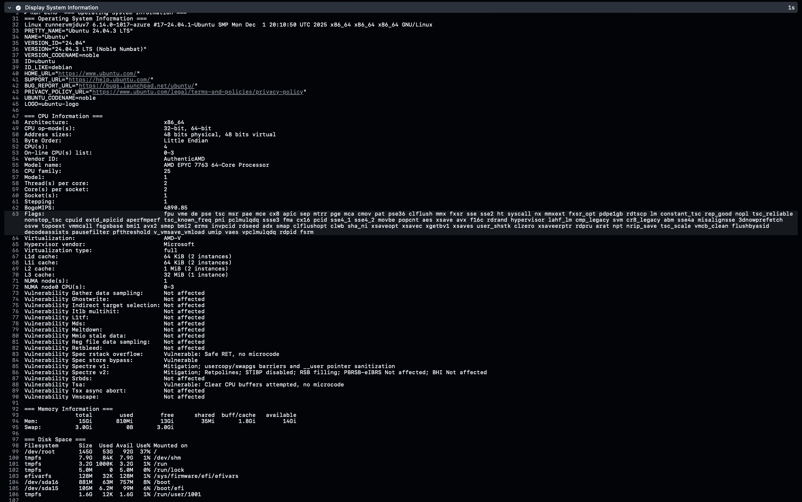

# Lab 3 Submission

## Task 1

### GitHub Actions Quickstart

Following the [GitHub Actions Quickstart guide](https://docs.github.com/en/actions/quickstart), I implemented a basic CI/CD workflow to understand the core features of GitHub Actions.

#### Steps Followed

1. Created workflow file `.github/workflows/github-actions-demo.yml`
2. Copied the YAML configuration from the quickstart guide
3. Committed the workflow file to the `feature/lab3` branch

### Workflow Execution and Testing

#### Successful Run Evidence

Link to successful workflow run: https://github.com/KosmonikOS/DevOps-Intro/actions/runs/22014127940
Screenshot showing the successful execution of the GitHub Actions Demo workflow in the Actions tab.

Detailed log output showing all steps executed during the workflow run.

#### Workflow Trigger Analysis

What caused the workflow to trigger:
- The workflow was triggered by a `push` event when I committed the workflow file to the `feature/lab3` branch
- The trigger configuration `on: [push]` instructs GitHub Actions to execute the workflow automatically whenever code is pushed to any branch in the repository

### Key Concepts Learned

#### Workflows
A workflow is an automated process defined in YAML format that runs one or more jobs. Workflows are:
- Stored in `.github/workflows/` directory
- Triggered by specific events (push, pull_request, schedule, etc.)
- Composed of one or more jobs that can run sequentially or in parallel

#### Jobs
Jobs are sets of steps that execute on the same runner. In our workflow:
- Job name: `Explore-GitHub-Actions`
- Jobs run in parallel by default unless dependencies are specified
- Each job runs in a fresh virtual environment

#### Steps
Steps are individual tasks within a job that:
- Execute sequentially within a job
- Can run commands (`run:`) or actions (`uses:`)
- Share the same runner environment and filesystem
- Can pass data between steps using outputs

#### Runners
Runners are servers that execute workflows:
- GitHub-hosted runners: Managed by GitHub (used here: `ubuntu-latest`)
- Self-hosted runners: Custom machines you manage
- Each runner provides a clean virtual environment for each job
- Available OS options: Ubuntu Linux, Windows, macOS

#### Events/Triggers
Events are specific activities that trigger workflow runs:
- `push`: Triggered when commits are pushed
- `pull_request`: Triggered on PR actions
- `workflow_dispatch`: Manual trigger
- `schedule`: Time-based triggers using cron syntax

#### Actions
Actions are reusable units of code:
- Can be used with `uses:` keyword
- Example in our workflow: `actions/checkout@v5` clones the repository
- Actions can be from GitHub Marketplace or custom-built
- Promote code reuse and standardization across workflows

#### Context Expressions
Context expressions provide dynamic values using `${{ }}` syntax:
- `${{ github.actor }}`: Username that triggered the workflow
- `${{ github.event_name }}`: Event that triggered the run
- `${{ runner.os }}`: Operating system of the runner
- `${{ github.ref }}`: Branch or tag reference
- `${{ github.repository }}`: Repository name
- `${{ github.workspace }}`: Working directory path
- `${{ job.status }}`: Current status of the job

### Workflow Execution Process Analysis

The workflow execution follows this sequence:

1. Trigger Detection
   - GitHub detects the push event on the `feature/lab3` branch
   - Matches the event against workflow trigger configurations
   - Queues the workflow for execution

2. Runner Provisioning
   - GitHub allocates an Ubuntu virtual machine (`ubuntu-latest`)

3. Job Initialization
   - Starts the `Explore-GitHub-Actions` job
   - Sets up environment variables and contexts
   - Prepares to execute the defined steps

4. Step Execution (Sequential)
   - Step 1: Logs the triggering event (`push`)
   - Step 2: Displays runner OS information (`Linux`)
   - Step 3: Shows branch reference and repository name
   - Step 4: Checks out repository code using `actions/checkout@v5`
     - This step clones the repository to `${{ github.workspace }}`
     - Essential for workflows that need to access repository files
   - Step 5-6: Confirmation messages about repository readiness
   - Step 7: Lists all files in the workspace
   - Step 8: Reports final job status (`success`)

5. Completion and Reporting
   - Job completes successfully
   - Status and logs are available in the Actions tab
   - Workflow run is marked as successful with a green checkmark

## Task 2

### Adding Manual Trigger

I extended the workflow to support manual triggering by adding the `workflow_dispatch` event to the trigger configuration.

Explanation:
- `workflow_dispatch` enables manual workflow execution from the GitHub UI
- The workflow now responds to both automatic (`push`) and manual (`workflow_dispatch`) triggers
- This provides flexibility for testing and on-demand execution without requiring code changes

### Adding System Information Collection Job

I added a new job called `System-Information` to gather detailed information about the GitHub-hosted runner environment. Check `System-Information` job in [workflow file](../.github/workflows/github-actions-demo.yml) for exact code added.

Information Gathered:
1. Operating System: Kernel version, distribution details
2. CPU: Architecture, cores, model information
3. Memory: Total, used, and available RAM
4. Disk Space: Available storage on runner
5. Runner Context: OS, architecture, name, tool cache location
6. Pre-installed Software: Python, Node.js, Docker, Git versions

### Manual Workflow Dispatch Evidence

Link to manually triggered workflow run: https://github.com/KosmonikOS/DevOps-Intro/actions/runs/22014423805

Screenshot showing the manual workflow dispatch interface with the "Run workflow" button and the resulting manually triggered run.

### System Information Collected from Runner

Detailed system information gathered from the GitHub-hosted runner.

Based on the collected data from the runner:

Operating System:
- Distribution: Ubuntu 22.04.5 LTS (Jammy Jellyfish)
- Kernel: Linux 6.1.0-1047-azure #7-24.04.1-Ubuntu SMP
- Architecture: x86_64 (64-bit)

CPU Specifications:
- Architecture: x86_64, 64-bit
- CPU Model: AMD EPYC 7763 64-Core Processor
- CPU Cores: 2 physical cores
- Threads per core: 2
- Total vCPUs: 4 (2 cores × 2 threads)
- CPU MHz: ~1495
- Virtualization: Full virtualization support (AMD-V)
- Hypervisor vendor: Microsoft
- Virtualization type: Full virtualization on Azure

Memory Information:
- Total RAM: 16GB
- Used: ~516MB
- Available: ~15GB
- Swap: 4GB total, 0 used

Disk Space:
- Root filesystem (/): 84GB total, 37GB used, 43GB available (47% usage)
- /mnt: 74GB total, 25MB used, 70GB available (1% usage)
- Total available storage: ~113GB usable

Runner Context Variables:
- Runner OS: Linux
- Runner Architecture: X64
- Runner Name: GitHub Actions
- Tool Cache: /opt/hostedtoolcache

Pre-installed Software Versions:
- Python: 3.12.8
- Node.js: v20.18.2
- Docker: 27.4.1, build b9d17ea
- Git: 2.48.1

### Comparison: Manual vs Automatic Workflow Triggers

| Aspect | Automatic Trigger (Push) | Manual Trigger (workflow_dispatch) |
|--------|-------------------------|-------------------------------------|
| Activation Method | Automatically triggered when code is pushed to repository | Manually triggered through GitHub UI by clicking "Run workflow" button |
| Event Name | `github.event_name` = `push` | `github.event_name` = `workflow_dispatch` |
| Use Cases | - Continuous Integration on code changes - Automated testing on commits - Deployment pipelines - Code quality checks | - On-demand workflow execution - Manual testing without code changes - Production deployments requiring approval - Debugging workflow issues |
| User Interaction | No user interaction required | Requires explicit user action from GitHub UI |
| Branch Selection | Runs on the branch that received the push | User can select any branch to run workflow on |
| Frequency | Occurs every time code is pushed | Only when manually triggered by authorized users |
| Context Information | Contains commit SHA, author, message details | Contains actor who triggered, selected branch |
| Best For | Regular automated CI/CD operations | Ad-hoc operations, testing, controlled deployments |
| Prerequisites | Requires code changes and push | No code changes needed, just workflow file with `workflow_dispatch` |
| Notification | Triggers on every matching push event | Triggers only when explicitly requested |
| Control Level | Automatic, no human intervention | Full human control over execution timing |

### Analysis of Runner Environment and Capabilities

#### Infrastructure Overview

GitHub Actions uses Microsoft Azure-hosted virtual machines to provide runners. The collected system information reveals a sophisticated, enterprise-grade environment designed for CI/CD workloads.

#### Virtualization and Isolation

Hypervisor: Microsoft Hyper-V on Azure
- Full Virtualization: Complete isolation between workflow runs
- Security: Each job runs in a fresh VM, preventing cross-contamination
- Consistency: Identical environment for every run
- Clean State: No leftover files or processes from previous runs

#### Additional Capabilities
- Multiple language runtimes pre-installed (Java, Ruby, Go, etc.)
- Build tools and compilers available
- Database clients for various databases
- Cloud CLI tools (Azure, AWS, Google Cloud)

#### Performance Characteristics
Startup Time: ~5-10 seconds for job initialization
Build Speed: Comparable to mid-range developer workstations
Network Speed: High-bandwidth Azure datacenter connectivity
Concurrency: Multiple workflows can run in parallel (subject to plan limits)

#### Network Capabilities

Connectivity:
- Full internet access for downloading dependencies
- Access to GitHub API and services
- Can connect to external services and APIs
- Supports webhook callbacks

#### Runner Limitations and Considerations

Time Limits:
- Maximum 6 hours per job
- Maximum 72 hours per workflow run

Resource Constraints:
- 2-core CPU might be limiting for very heavy parallel builds
- No GPU acceleration (for ML/AI workloads)
- Network speed subject to Azure datacenter limits

Storage Considerations:
- Ephemeral storage - lost after job completes
- Must use artifacts or external storage for persistence
- Cache actions available for dependency caching